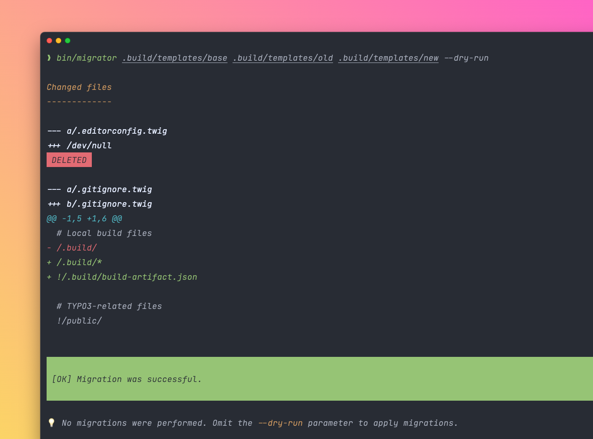

<div align="center">

[](#-installation)

# Migrator

[](https://codecov.io/gh/CPS-IT/migrator)
[](https://codeclimate.com/github/CPS-IT/migrator/maintainability)
[](https://github.com/CPS-IT/migrator/actions/workflows/tests.yaml)
[](https://github.com/CPS-IT/migrator/actions/workflows/cgl.yaml)
[](https://packagist.org/packages/cpsit/migrator)
[](https://packagist.org/packages/cpsit/migrator)
[](LICENSE)

:package:&nbsp;[Packagist](https://packagist.org/packages/cpsit/migrator) |
:floppy_disk:&nbsp;[Repository](https://github.com/CPS-IT/migrator) |
:bug:&nbsp;[Issue tracker](https://github.com/CPS-IT/migrator/issues)

</div>

A PHP library to perform migrations of files with a calculated diff between two
code bases using three-way merge. Uses the [`cypresslab/gitelephant`][1] package
for any Git operations and provides an interface for custom differ implementations.

## 🚀 Features

* Automatic file content migration
* Various implementations for source and target code base
* Interface for custom differ implementations

## 🔥 Installation

```bash
composer require cpsit/migrator
```

## ⚡ Usage

### Command-line

```bash
vendor/bin/migrator [options] <base-directory> <source-directory> <target-directory>
```

Available options:

* **`--dry-run`** does not perform migrations, but only calculated and shows
  diff between the code bases
* **`--verbose`** shows the calculated diff (implicitly enabled with `--dry-run`)

### PHP

```php
use CPSIT\Migrator\Diff;
use CPSIT\Migrator\Resource;
use CPSIT\Migrator\Migrator;
use GitElephant;

// The base directory contains all files
// that should be migrated
$baseDirectory = '/path/to/base/directory';

// Source and target define the code bases
// that are used to generate a diff
$source = new Resource\Collector\DirectoryCollector('/path/to/old/revision/files');
$target = new Resource\Collector\DirectoryCollector('/path/to/current/revision/files');

// Decide whether to actually perform migrations
// or just calculate a diff between the code bases
$performMigrations = true;

// Create differ and migrator
$differ = new Diff\Differ\GitDiffer();
$migrator = new Migrator($differ, $performMigrations);

// Migrate files in your base directory
$diffResult = $migrator->migrate($source, $target, $baseDirectory);

// Print diff
foreach ($diffResult->getDiffObjects() as $diffObject) {
    echo '--- a/'.$diffObject->getOriginalPath().PHP_EOL;
    echo '+++ b/'.$diffObject->getDestinationPath().PHP_EOL;

    foreach ($diffObject->getChunks() as $diffChunk) {
        echo $diffChunk->getHeaderLine().PHP_EOL;

        foreach ($diffChunk as $diffChunkLine) {
            echo $diffChunkLine.PHP_EOL;
        }
    }
}
```

## 🎢 Architecture

### Lifecycle

In order to generate a diff between two code bases, you must provide two collections
of [resources](#resource). This, for example, can be a directory with template files
of a previous revision compared to a directory with template files of a current
revision. Additionally, you must provide a base directory containing all files to be
migrated.

The migration is calculated by a [differ](#differ). It will generate and apply a diff
between both code bases and the provided base files using the [three-way merge][2]
strategy.

### Resource

All relevant code bases (source and target) must be represented by a
[`Resource\Collector\CollectorInterface`](src/Resource/Collector/CollectorInterface.php).
The following implementations are currently available:

- [`ArrayCollector`](src/Resource/Collector/ArrayCollector.php) holds all relevant
  resources in a plain array.
- [`CallbackCollector`](src/Resource/Collector/CallbackCollector.php) provides all
  relevant resources through a configured callback function.
- [`ChainedCollector`](src/Resource/Collector/ChainedCollector.php) holds multiple
  collectors that are called one after the other.
- [`DirectoryCollector`](src/Resource/Collector/DirectoryCollector.php) provides all
  relevant resources within a configured base directory.
- [`FileCollector`](src/Resource/Collector/FileCollector.php) provides a single file
  as resource collection.

### Differ

Diffs are calculated by an implementation of
[`Diff\Differ\Differ`](src/Diff/Differ/Differ.php). The
following implementations are currently available:

- [`GitDiffer`](src/Diff/Differ/GitDiffer.php) uses the native Git binary to create
  diffs. This is done by the great library [`cypresslab/gitelephant`][1].

## 🧑‍💻 Contributing

Please have a look at [`CONTRIBUTING.md`](CONTRIBUTING.md).

## ⭐ License

This project is licensed under [GNU General Public License 3.0 (or later)](LICENSE).

[1]: https://packagist.org/packages/cypresslab/gitelephant
[2]: https://git-scm.com/book/en/v2/Git-Branching-Basic-Branching-and-Merging#_basic_merging
